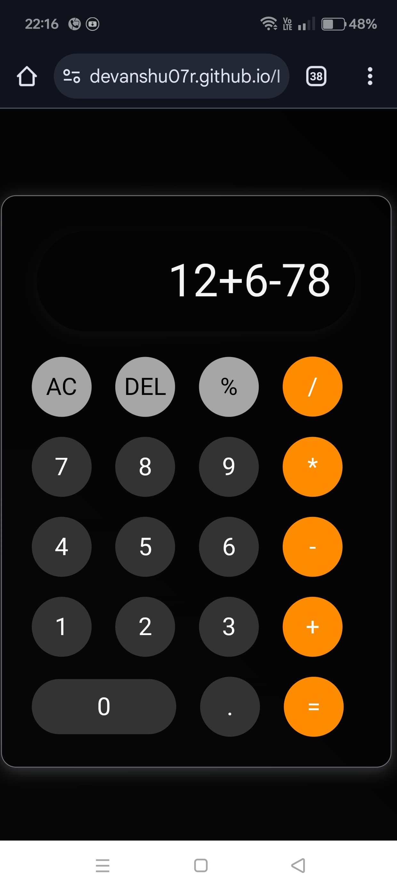

<h1 align="center">📱 iPhone Calculator</h1>

<p align="center">
  A high-fidelity iOS-style calculator built using HTML, Tailwind CSS, and JavaScript.
  Experience seamless interactions, pixel-perfect design, and accurate operations—right in your browser.
</p>

<p align="center">
  <a href="https://devanshu07r.github.io/IPhoneCalculator/" target="_blank">
    
  </a>
  <a href="https://github.com/devanshu07r/IPhoneCalculator/stargazers">
    
  </a>
  <a href="https://opensource.org/licenses/MIT">
    
  </a>
</p>

---

<p align="center">
  
</p>

---

## 📖 Overview

The **iPhone Calculator** replicates the native iOS calculator interface and functionality for web users. Built with modern frontend technologies, this responsive, browser-based calculator offers a fluid UX with real-time interactions.

---

## ✨ Features

- 🎨 Pixel-perfect iPhone-style design 
- ➗ Supports basic arithmetic and percentage  
- ⚡ Fast and responsive UI  
- 📱 Fully mobile-compatible  
- 🌙 Optional dark and light mode toggle  

---

## 🔧 Tech Stack

- **HTML** – Structure  
- **Tailwind CSS** – Styling & Layout  
- **JavaScript** – Functionality & Logic  

---

## 🚀 Getting Started....

---


🌐 Live Demo
Click below to experience the calculator in action:
🔗  https://devanshu07r.github.io/IPhoneCalculator


---

---

Demo

🤝 Contributing
Contributions are welcome!
If you'd like to improve this project:

Fork the repository

Create a feature branch (git checkout -b feature-name)

Commit your changes (git commit -m 'Add some feature')

Push to your branch (git push origin feature-name)

Open a Pull Request

---

---

📄 License
This project is licensed under the MIT License.
Feel free to use it in personal or commercial projects.
See the LICENSE file for more details.

---

---

🧑‍💻 Author
Made with ❤️ by Devanshu Dasgupta

💼 LinkedIn: https://www.linkedin.com/in/devanshu-dasgupta-509641299

💻 GitHub: https://github.com/Devanshu07R

🌐 Portfolio Website

---

```bash
# Clone this repository
git clone https://github.com/devanshu07r/IPhoneCalculator.git

# Navigate into the folder
cd IPhoneCalculator

# Open index.html in your browser
start index.html  # On Windows

# or

open index.html  # On macOS

# or manually drag and drop the index.html into your browser
